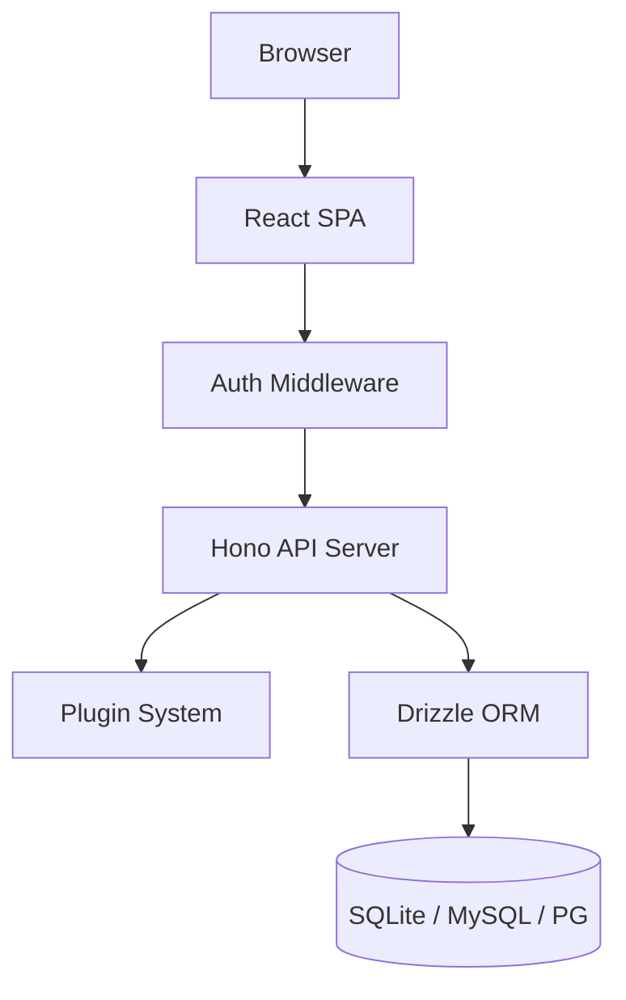

# OrganizrX

A modern, TypeScript-native media server dashboard rebuilt from the ground up.

[](https://www.gnu.org/licenses/gpl-3.0)
[](https://github.com/organizrx/organizrx/actions)
[](https://www.typescriptlang.org/)
[](https://bun.sh/)
[](https://www.docker.com/)

## What is OrganizrX?

OrganizrX is a complete modern rewrite of the legacy PHP Organizr project using TypeScript and Bun. It serves as a self-hosted media server dashboard that consolidates all your services, such as Plex, Sonarr, and Radarr, into a single tabbed interface. This project focuses on high performance, strict type safety, and a unified experience for home-lab enthusiasts.

## Features

| Category           | Features                                                                                                        |
| :----------------- | :-------------------------------------------------------------------------------------------------------------- |
| **Tab Management** | Tab categories, drag-and-drop ordering, iframe isolation                                                        |
| **Access Control** | Admin, Co-Admin, Super User, Power User, User, and Guest tiers                                                  |
| **Authentication** | Local, Plex OAuth, LDAP/AD, OIDC (Authentik/Keycloak), Auth Proxy, 2FA (TOTP)                                   |
| **Plugins**        | 41 plugins (10 active: Plex, Sonarr, Radarr, SABnzbd, Overseerr, Tautulli, Jellyfin, qBittorrent, Emby, NZBGet) |
| **Dashboard**      | Homepage widgets powered by plugins, bookmark categories                                                        |
| **Onboarding**     | Invite system for new user registration                                                                         |
| **Customization**  | Dark and light themes with custom color selection                                                               |
| **Maintenance**    | Backup and restore with automated retention policies, update checker                                            |
| **Security**       | Connection tester with SSRF protection, secure JWT handling                                                     |
| **Migration**      | In-place migration from legacy PHP Organizr (auto-detects and migrates schema)                                  |
| **Infrastructure** | Multi-database support (SQLite, MySQL, PostgreSQL), structured logging                                          |

## Tech Stack

| Technology      | Purpose                                            |
| :-------------- | :------------------------------------------------- |
| Bun             | Runtime, package manager, test runner, and bundler |
| Hono            | Lightweight HTTP framework for the API server      |
| React 18        | Frontend Single Page Application                   |
| Vite            | Frontend build tool and development server         |
| Tailwind CSS v4 | Utility-first styling engine                       |
| Drizzle ORM     | Type-safe database abstraction                     |
| Zod             | Runtime schema validation                          |
| jose            | Secure JWT authentication                          |
| pino            | Structured JSON logging                            |
| Docusaurus      | Documentation site engine                          |

## Architecture



## Quick Start (Docker)

Run the dashboard with a single command:

```bash
docker run -d --name organizrx -p 3001:3001 -v ./data:/app/data dawidkulpa/organizrx:latest
```

### Docker Compose

```yaml
services:
  organizrx:
    image: dawidkulpa/organizrx:latest
    container_name: organizrx
    ports:
      - '3001:3001'
    environment:
      JWT_SECRET: your-secure-secret-min-32-chars
      DATABASE_DIALECT: sqlite
      DATABASE_URL: /app/data/organizr.db
    volumes:
      - ./data:/app/data
      - ./config:/app/config
    restart: unless-stopped
```

## Installation

### Prerequisites

- Bun >= 1.x

### Bare Metal Setup

1. Clone the repository:

   ```bash
   git clone https://github.com/organizrx/organizrx.git
   cd organizrx
   ```

2. Install dependencies:

   ```bash
   bun install
   ```

3. Build and start:
   ```bash
   bun run build
   bun run start
   ```

## Development

Run the development environment (Server on 3001, Web on 5173):

```bash
bun install
bun run dev
```

Run quality checks:

```bash
bun test
bun run check
```

## Monorepo Structure

```text
organizrx/
├── apps/
│   ├── server/          # Hono API backend
│   └── web/             # React frontend SPA
├── packages/
│   ├── shared/          # Shared types, schemas, and constants
│   └── plugin-sdk/      # Plugin development SDK
├── plugins/
│   └── packages/        # 41 plugin implementations
└── docs/                # Docusaurus documentation site
```

## Migrating from Organizr

OrganizrX supports in-place migrations from your existing PHP Organizr setup. The system can connect to your legacy database, detect the schema version, and automatically migrate your settings and users. Refer to the [migration guide](./docs/docs/user-guide/migration.md) for specific steps.

## Documentation

Full documentation is available at [https://github.com/organizrx/organizrx](https://github.com/organizrx/organizrx).

## Contributing

We welcome contributions. Please review [CONTRIBUTING.md](CONTRIBUTING.md) before submitting a pull request.

## License

This project is licensed under the GNU General Public License v3.0. See the [LICENSE](LICENSE) file for details.
