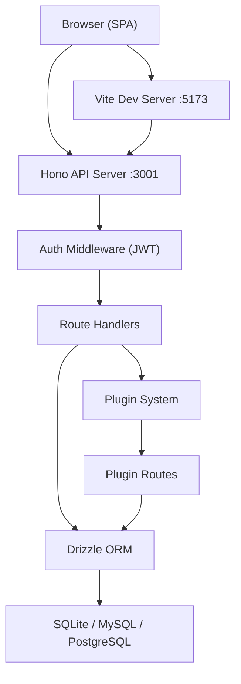
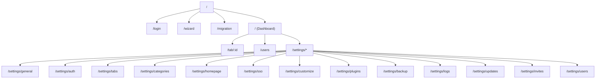
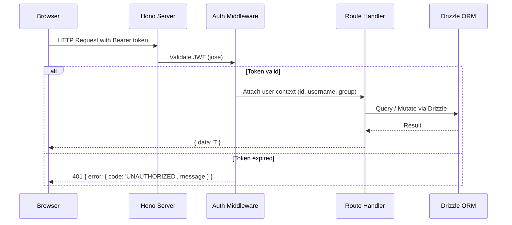
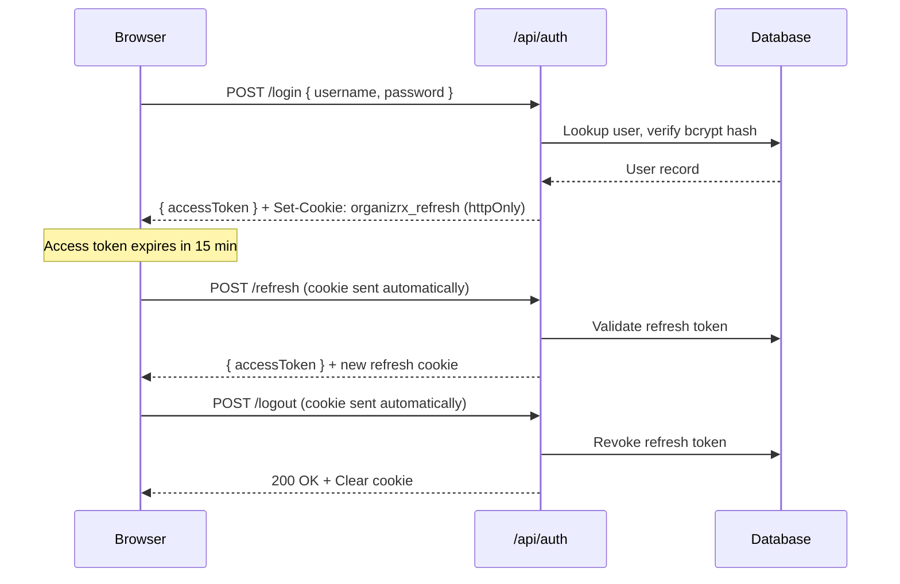
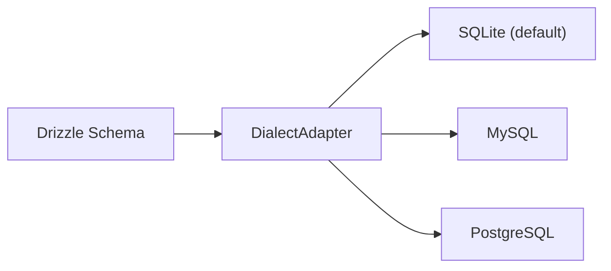
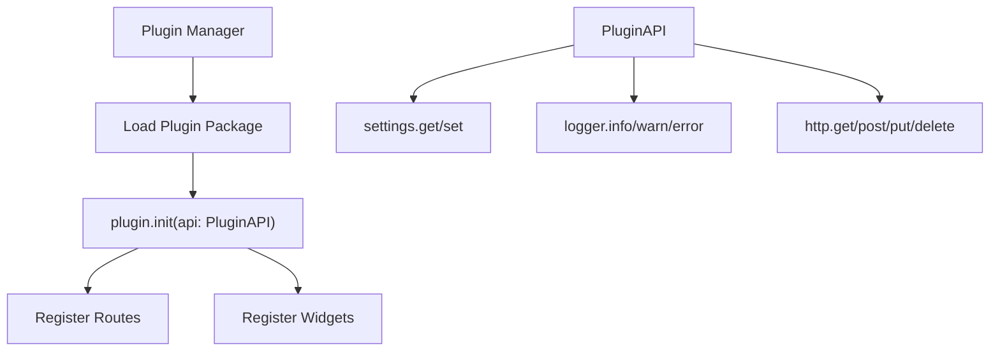

# Architecture

OrganizrX is a full-stack TypeScript monorepo that replaces the legacy PHP Organizr dashboard. This document describes the system design, component relationships, and key architectural decisions.

## High-Level Overview



The frontend is a React SPA served by Vite in development and as static files in production. All data flows through the Hono API server, which enforces authentication via JWT middleware before dispatching to route handlers. Route handlers interact with the database exclusively through Drizzle ORM and may delegate to the plugin system for extensible functionality.

## Monorepo Structure

```text
organizrx/
├── apps/
│   ├── server/              # Hono API backend (Bun runtime)
│   │   ├── src/
│   │   │   ├── index.ts     # Server entry, route mounting, CORS, health check
│   │   │   ├── routes/      # 20+ route modules
│   │   │   ├── db/          # Drizzle schema, adapters, migrations
│   │   │   ├── middleware/   # Auth, rate limiting
│   │   │   ├── config/      # Environment validation (Zod)
│   │   │   └── services/    # Business logic layer
│   │   └── drizzle/         # Generated migration files
│   └── web/                 # React frontend SPA
│       ├── src/
│       │   ├── router.tsx   # Route definitions (TanStack Router)
│       │   ├── store/       # Zustand state stores
│       │   ├── api/         # Axios client with auth interceptors
│       │   ├── hooks/       # Auth guards, session init, auto-refresh
│       │   ├── components/  # Shared UI components
│       │   └── pages/       # Page-level components
│       └── index.html
├── packages/
│   ├── shared/              # Zod schemas, TypeScript types, constants
│   └── plugin-sdk/          # Plugin interfaces and contracts
├── plugins/
│   └── packages/            # Official and community plugin implementations
└── docs/                    # Docusaurus documentation site
```

## Component Architecture

### Server (`apps/server`)

The server is a Hono application running on the Bun runtime. The entry point (`src/index.ts`) configures CORS, registers all route groups, and starts listening.

**Route mounting order (from `index.ts`):**

```typescript
// Public routes (no auth)
app.route('/api/auth', authRoutes)
app.route('/api/auth', plexAuthRoutes)
app.route('/api/auth', ldapAuthRoutes)
app.route('/api/auth', oidcAuthRoutes)
app.route('/api/wizard', wizardRoutes)

// Protected routes (auth middleware applied per-route)
app.route('/api/auth/2fa', auth2faRoutes)
app.route('/api/users', userRoutes)
app.route('/api/groups', groupRoutes)
app.route('/api/categories', categoryRoutes)
app.route('/api/tabs', tabRoutes)
app.route('/api/settings', settingsRoutes)
app.route('/api/bookmarks', bookmarkRoutes)
app.route('/api/invites', inviteRoutes)
app.route('/api/sso', ssoRoutes)
app.route('/api/plugins', pluginManagementRoutes)
app.route('/api/migration', migrationRoutes)
app.route('/api/backup', backupRoutes)
app.route('/api/test-connection', connectionTesterRoutes)
app.route('/api/images', imageRoutes)
app.route('/api/update', updateRoutes)
app.route('/api/logs', logRoutes)
```

**Inline endpoints:**

- `GET /api/health` -- returns `{ status: 'ok', timestamp }` (no auth)
- `GET /api/settings/public` -- returns `{ LDAP_ENABLED, PLEX_ENABLED, OIDC_ENABLED, SITE_TITLE }` (no auth)

### Frontend (`apps/web`)

The frontend is a React 18 SPA built with Vite and styled with Tailwind CSS v4. Routing uses TanStack Router with the following structure:



### Shared Packages

- **`@organizrx/shared`** -- Zod schemas for API validation, shared TypeScript types, and constants used by both server and frontend.
- **`@organizrx/plugin-sdk`** -- Defines the `OrganizrPlugin` interface, `PluginManifest`, `WidgetDefinition`, and the `PluginAPI` surface that plugins receive at initialization.

## Request Lifecycle



1. The client sends an HTTP request with a `Bearer` token in the `Authorization` header.
2. The auth middleware (`src/middleware/auth.ts`) verifies the JWT using the `jose` library. On success, it attaches `userId`, `username`, and `groupId` to the Hono context.
3. Optional group-based authorization via `requireGroup(n)` checks that the user's group ID is less than or equal to `n` (lower number = higher privilege).
4. The route handler executes business logic through Drizzle ORM.
5. Responses follow a standard envelope: `{ data: T }` for success, `{ error: { code, message } }` for errors.

## Authentication Flow



- **Access tokens**: JWT, 15-minute expiry, sent as `Bearer` in the `Authorization` header.
- **Refresh tokens**: Stored in an `httpOnly` cookie named `organizrx_refresh`, 7-day expiry. This prevents XSS attacks from accessing refresh tokens.
- **Supported providers**: Local (bcrypt), Plex OAuth, LDAP/Active Directory, OIDC (Authentik, Keycloak), and Auth Proxy.
- **Two-factor authentication**: TOTP-based via `/api/auth/2fa` endpoints.

## Authorization Model

OrganizrX uses a numeric group-based authorization hierarchy:

| Group ID | Role       | Description                              |
| -------- | ---------- | ---------------------------------------- |
| 0        | Admin      | Full system access                       |
| 1        | Co-Admin   | Nearly full access, cannot manage admins |
| 2        | Super User | Extended access to most features         |
| 3        | Power User | Standard elevated access                 |
| 4        | User       | Basic authenticated access               |
| 999      | Guest      | Minimal, unauthenticated access          |

The `requireGroup(n)` middleware enforces that a user's `groupId <= n`. For example, `requireGroup(1)` permits only Admins and Co-Admins.

## Database Architecture

OrganizrX supports three database dialects through a unified adapter pattern:



The `DialectAdapter` in `src/db/schema/adapter.ts` provides dialect-specific column builders (`pk`, `text`, `integer`, `datetime`) that return the correct Drizzle column types for each database engine. Schema definitions in `tables.ts` call these builders so the same schema works across all three dialects.

See the [Database](./database) page for full schema documentation.

## Plugin Architecture



Plugins implement the `OrganizrPlugin` interface from `@organizrx/plugin-sdk`. At initialization, they receive a `PluginAPI` object providing:

- **Settings** -- key-value storage scoped to the plugin
- **Logger** -- structured logging with the plugin name as context
- **HTTP** -- an HTTP client for external API calls (with SSRF protection)

Plugins can register Hono routes (mounted under `/api/plugins/:name/`) and widget definitions for the homepage dashboard.

See the [Plugin Development](./plugin-development) page for the full SDK reference.

## Design Decisions

### Why Bun over Node.js

Bun provides a single tool for runtime execution, package management, testing, and bundling. This eliminates the need for separate tools (Node + npm/yarn + Jest + esbuild) and provides significantly faster startup and execution times.

### Why Hono over Express

Hono is designed for edge and serverless runtimes with a minimal footprint. It provides built-in TypeScript support, middleware composition, and runs natively on Bun without compatibility layers.

### Why Drizzle over Prisma

Drizzle generates zero runtime overhead and produces SQL that maps directly to the query builder calls. Its dialect adapter pattern allows OrganizrX to support SQLite, MySQL, and PostgreSQL from a single schema definition without code generation steps.

### Why Zustand over Redux

Zustand provides a minimal, hook-based state management API without boilerplate. The four stores (auth, theme, lockscreen, UI) are small and independent, making Zustand's atomic store pattern a natural fit.

### Why httpOnly Cookies for Refresh Tokens

Storing refresh tokens in `httpOnly` cookies prevents JavaScript (and therefore XSS attacks) from accessing them. Only the access token (short-lived, 15 minutes) is exposed to JavaScript. This follows OWASP recommendations for token storage in SPAs.
