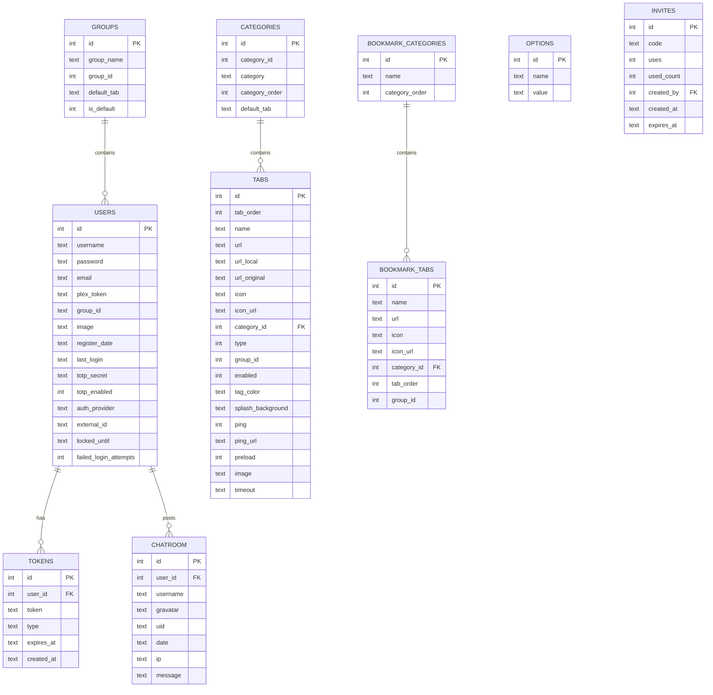

# Database

OrganizrX uses Drizzle ORM with a dialect adapter pattern to support SQLite, MySQL, and PostgreSQL from a single schema definition. This page documents the schema, adapter system, migration workflow, and query patterns.

## Dialect Adapter

The adapter in `apps/server/src/db/schema/adapter.ts` abstracts column type differences across databases:

```typescript
interface DialectAdapter {
  pk(name: string): Column // Auto-increment primary key
  text(name: string): Column // Variable-length text
  integer(name: string): Column // Integer column
  datetime(name: string): Column // Timestamp column
}
```

Each database dialect provides its own implementation:

| Builder    | SQLite                                          | MySQL                   | PostgreSQL              |
| ---------- | ----------------------------------------------- | ----------------------- | ----------------------- |
| `pk`       | `integer().primaryKey({ autoIncrement: true })` | `serial().primaryKey()` | `serial().primaryKey()` |
| `text`     | `text()`                                        | `varchar(255)`          | `text()`                |
| `integer`  | `integer()`                                     | `int()`                 | `integer()`             |
| `datetime` | `text()`                                        | `datetime()`            | `timestamp()`           |

The active dialect is selected by the `DATABASE_DIALECT` environment variable (`sqlite`, `mysql`, or `postgresql`).

## Entity-Relationship Diagram



## Table Reference

### users

Stores all user accounts with authentication data.

| Column                  | Type    | Description                                          |
| ----------------------- | ------- | ---------------------------------------------------- |
| `id`                    | PK      | Auto-increment primary key                           |
| `username`              | text    | Unique username                                      |
| `password`              | text    | Bcrypt hash (12+ rounds)                             |
| `email`                 | text    | User email address                                   |
| `plex_token`            | text    | Plex authentication token (nullable)                 |
| `group_id`              | text    | User's group assignment (references group hierarchy) |
| `image`                 | text    | Profile image path (nullable)                        |
| `register_date`         | text    | Account creation timestamp                           |
| `last_login`            | text    | Last successful login timestamp                      |
| `totp_secret`           | text    | TOTP secret for 2FA (nullable)                       |
| `totp_enabled`          | integer | Whether 2FA is active (0 or 1)                       |
| `auth_provider`         | text    | Authentication method (local, plex, ldap, oidc)      |
| `external_id`           | text    | External provider user ID (nullable)                 |
| `locked_until`          | text    | Account lock expiry timestamp (nullable)             |
| `failed_login_attempts` | integer | Consecutive failed login count                       |

### tokens

Stores refresh tokens and other authentication tokens.

| Column       | Type    | Description                  |
| ------------ | ------- | ---------------------------- |
| `id`         | PK      | Auto-increment primary key   |
| `user_id`    | integer | References `users.id`        |
| `token`      | text    | Token value (hashed)         |
| `type`       | text    | Token type (e.g., `refresh`) |
| `expires_at` | text    | Expiry timestamp             |
| `created_at` | text    | Creation timestamp           |

### groups

Defines the authorization hierarchy.

| Column        | Type    | Description                           |
| ------------- | ------- | ------------------------------------- |
| `id`          | PK      | Auto-increment primary key            |
| `group_name`  | text    | Display name (e.g., "Admin")          |
| `group_id`    | integer | Numeric privilege level (0 = highest) |
| `default_tab` | text    | Default tab for this group (nullable) |
| `is_default`  | integer | Whether this is the default group     |

### categories

Groups tabs into logical sections in the sidebar.

| Column           | Type    | Description                   |
| ---------------- | ------- | ----------------------------- |
| `id`             | PK      | Auto-increment primary key    |
| `category_id`    | integer | Legacy-compatible category ID |
| `category`       | text    | Category display name         |
| `category_order` | integer | Sort order (lower = first)    |
| `default_tab`    | text    | Default tab in this category  |

### tabs

Each tab represents a service or page in the dashboard.

| Column              | Type    | Description                                   |
| ------------------- | ------- | --------------------------------------------- |
| `id`                | PK      | Auto-increment primary key                    |
| `tab_order`         | integer | Sort order within category                    |
| `name`              | text    | Tab display name                              |
| `url`               | text    | Service URL                                   |
| `url_local`         | text    | Local/internal URL override (nullable)        |
| `url_original`      | text    | Original URL before any modifications         |
| `icon`              | text    | Icon identifier (nullable)                    |
| `icon_url`          | text    | Custom icon URL (nullable)                    |
| `category_id`       | integer | References `categories.id`                    |
| `type`              | integer | 0 = internal page, 1 = iframe                 |
| `group_id`          | integer | Minimum group level for access                |
| `enabled`           | integer | Whether the tab is active (0 or 1)            |
| `tag_color`         | text    | Color for the tab badge (nullable)            |
| `splash_background` | text    | Background image for splash screen (nullable) |
| `ping`              | integer | Whether to ping the service (0 or 1)          |
| `ping_url`          | text    | Custom ping URL (nullable)                    |
| `preload`           | integer | Whether to preload the tab iframe (0 or 1)    |
| `image`             | text    | Tab image/thumbnail (nullable)                |
| `timeout`           | text    | Connection timeout for the service (nullable) |

### options

Key-value settings storage used by both core and plugins.

| Column  | Type | Description                          |
| ------- | ---- | ------------------------------------ |
| `id`    | PK   | Auto-increment primary key           |
| `name`  | text | Setting key (unique)                 |
| `value` | text | Setting value (serialized as string) |

Plugin settings use a namespaced key format: `plugin:<plugin-name>:<key>`.

### invites

Manages invite codes for user registration.

| Column       | Type    | Description                               |
| ------------ | ------- | ----------------------------------------- |
| `id`         | PK      | Auto-increment primary key                |
| `code`       | text    | Unique invite code                        |
| `uses`       | integer | Maximum number of uses                    |
| `used_count` | integer | Current number of redemptions             |
| `created_by` | integer | References `users.id` (admin who created) |
| `created_at` | text    | Creation timestamp                        |
| `expires_at` | text    | Expiry timestamp (nullable)               |

### chatroom

Legacy chat message storage.

| Column     | Type    | Description                 |
| ---------- | ------- | --------------------------- |
| `id`       | PK      | Auto-increment primary key  |
| `user_id`  | integer | References `users.id`       |
| `username` | text    | Username at time of message |
| `gravatar` | text    | Gravatar hash (nullable)    |
| `uid`      | text    | Unique message identifier   |
| `date`     | text    | Message timestamp           |
| `ip`       | text    | Sender IP address           |
| `message`  | text    | Message content             |

### bookmark_categories

Categories for organizing bookmark links.

| Column           | Type    | Description                |
| ---------------- | ------- | -------------------------- |
| `id`             | PK      | Auto-increment primary key |
| `name`           | text    | Category display name      |
| `category_order` | integer | Sort order                 |

### bookmark_tabs

Individual bookmark links within categories.

| Column        | Type    | Description                         |
| ------------- | ------- | ----------------------------------- |
| `id`          | PK      | Auto-increment primary key          |
| `name`        | text    | Bookmark display name               |
| `url`         | text    | Bookmark URL                        |
| `icon`        | text    | Icon identifier (nullable)          |
| `icon_url`    | text    | Custom icon URL (nullable)          |
| `category_id` | integer | References `bookmark_categories.id` |
| `tab_order`   | integer | Sort order within category          |
| `group_id`    | integer | Minimum group level for visibility  |

## Column Naming Convention

All database columns use `snake_case` to maintain compatibility with the legacy PHP Organizr schema. This allows the migration system to transfer data directly without column renaming.

In TypeScript code, Drizzle maps these to camelCase automatically when using the query builder.

## Migration Workflow

### Creating Migrations

1. Modify the schema in `apps/server/src/db/schema/tables.ts`.

2. Generate a migration file:

   ```bash
   bunx drizzle-kit generate
   ```

3. Apply the migration to your development database:

   ```bash
   bunx drizzle-kit push
   ```

4. Commit both the schema changes and the generated migration file in `apps/server/drizzle/`.

### Migration Files

Generated migrations are stored in `apps/server/drizzle/` as SQL files. Each migration is timestamped and applied in order. Drizzle tracks which migrations have been applied in a `__drizzle_migrations` metadata table.

### Legacy Migration

OrganizrX includes a built-in migration system for importing data from legacy PHP Organizr databases. The migration:

1. Connects to the legacy database via `LEGACY_DB_PATH` or `LEGACY_DB_URL` environment variables.
2. Detects the schema version automatically.
3. Streams progress updates via SSE through `POST /api/migration/start`.
4. Migrates users, tabs, categories, settings, and groups.

## Query Patterns

### Basic CRUD

All database interaction goes through Drizzle ORM. No raw SQL strings are permitted.

```typescript
import { db } from '../db'
import { users } from '../db/schema/tables'
import { eq } from 'drizzle-orm'

// Select
const allUsers = await db.select().from(users)
const user = await db.select().from(users).where(eq(users.id, 1))

// Insert
const [newUser] = await db
  .insert(users)
  .values({
    username: 'newuser',
    password: hashedPassword,
    email: 'user@example.com',
    group_id: '4',
    register_date: new Date().toISOString(),
  })
  .returning()

// Update
await db.update(users).set({ last_login: new Date().toISOString() }).where(eq(users.id, 1))

// Delete
await db.delete(users).where(eq(users.id, 1))
```

### Filtering and Ordering

```typescript
import { eq, and, gt, asc } from 'drizzle-orm'

// Multiple conditions
const activeAdmins = await db
  .select()
  .from(users)
  .where(and(eq(users.group_id, '0'), gt(users.last_login, cutoffDate)))
  .orderBy(asc(users.username))
```

### Transactions

```typescript
await db.transaction(async (tx) => {
  await tx.insert(users).values({
    /* ... */
  })
  await tx.insert(tokens).values({
    /* ... */
  })
})
```

## Environment Configuration

Database-related environment variables (validated with Zod in `apps/server/src/config/env.ts`):

| Variable           | Required | Default  | Description                                         |
| ------------------ | -------- | -------- | --------------------------------------------------- |
| `DATABASE_DIALECT` | No       | `sqlite` | Database engine: `sqlite`, `mysql`, or `postgresql` |
| `DATABASE_URL`     | Yes      | --       | Connection string or file path                      |
| `LEGACY_DB_PATH`   | No       | --       | Path to legacy PHP Organizr SQLite DB               |
| `LEGACY_DB_URL`    | No       | --       | Connection URL for legacy MySQL/PostgreSQL          |
