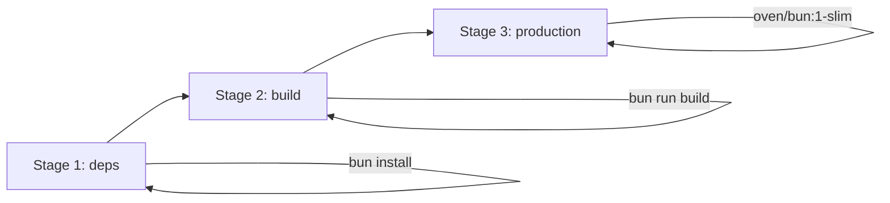

# Deployment

This guide covers deploying OrganizrX using Docker, bare metal, and configuration through environment variables.

## Docker (Recommended)

### Quick Start

```bash
docker run -d \
  --name organizrx \
  -p 3001:3001 \
  -e JWT_SECRET="your-secure-secret-min-32-characters-long" \
  -e DATABASE_DIALECT=sqlite \
  -e DATABASE_URL=/app/data/organizr.db \
  -v ./data:/app/data \
  dawidkulpa/organizrx:latest
```

### Docker Compose

The repository includes a `docker-compose.yml` with full configuration:

```yaml
services:
  organizrx:
    image: dawidkulpa/organizrx:latest
    container_name: organizrx
    build:
      context: .
      dockerfile: Dockerfile
    ports:
      - '3001:3001'
    environment:
      NODE_ENV: production
      JWT_SECRET: your-secure-secret-min-32-characters-long
      DATABASE_DIALECT: sqlite
      DATABASE_URL: /app/data/organizr.db
      LOG_LEVEL: info
    volumes:
      - ./data:/app/data
      - ./config:/app/config
    restart: unless-stopped
    healthcheck:
      test: ['CMD', 'curl', '-f', 'http://localhost:3001/api/health']
      interval: 30s
      timeout: 10s
      retries: 3
      start_period: 10s
```

### With MySQL

```yaml
services:
  organizrx:
    image: dawidkulpa/organizrx:latest
    container_name: organizrx
    ports:
      - '3001:3001'
    environment:
      NODE_ENV: production
      JWT_SECRET: your-secure-secret-min-32-characters-long
      DATABASE_DIALECT: mysql
      DATABASE_URL: mysql://organizrx:password@db:3306/organizrx
    depends_on:
      db:
        condition: service_healthy
    restart: unless-stopped

  db:
    image: mysql:8
    container_name: organizrx-db
    environment:
      MYSQL_ROOT_PASSWORD: rootpassword
      MYSQL_DATABASE: organizrx
      MYSQL_USER: organizrx
      MYSQL_PASSWORD: password
    volumes:
      - mysql_data:/var/lib/mysql
    healthcheck:
      test: ['CMD', 'mysqladmin', 'ping', '-h', 'localhost']
      interval: 10s
      timeout: 5s
      retries: 5

volumes:
  mysql_data:
```

### With PostgreSQL

```yaml
services:
  organizrx:
    image: dawidkulpa/organizrx:latest
    container_name: organizrx
    ports:
      - '3001:3001'
    environment:
      NODE_ENV: production
      JWT_SECRET: your-secure-secret-min-32-characters-long
      DATABASE_DIALECT: postgresql
      DATABASE_URL: postgresql://organizrx:password@db:5432/organizrx
    depends_on:
      db:
        condition: service_healthy
    restart: unless-stopped

  db:
    image: postgres:16
    container_name: organizrx-db
    environment:
      POSTGRES_DB: organizrx
      POSTGRES_USER: organizrx
      POSTGRES_PASSWORD: password
    volumes:
      - pg_data:/var/lib/postgresql/data
    healthcheck:
      test: ['CMD-SHELL', 'pg_isready -U organizrx']
      interval: 10s
      timeout: 5s
      retries: 5

volumes:
  pg_data:
```

## Dockerfile

The production Dockerfile uses a multi-stage build:



**Stage 1 (deps)**: Installs all dependencies including devDependencies.

**Stage 2 (build)**: Copies source code and runs `bun run build` to produce production artifacts.

**Stage 3 (production)**: Uses `oven/bun:1-slim` as the base image. Copies only the built artifacts and production dependencies. Runs as a non-root user for security.

Key Dockerfile features:

- **Non-root user**: The application runs as a dedicated `organizrx` user, not as root.
- **Health check**: Built-in `HEALTHCHECK` instruction that curls `/api/health`.
- **Minimal image**: The production stage only includes runtime dependencies, keeping the image small.

## Bare Metal

### Prerequisites

- Bun >= 1.x

### Steps

```bash
# Clone and install
git clone https://github.com/dawidkulpa/organizrx.git
cd organizrx
bun install

# Build production artifacts
bun run build

# Set environment variables
export NODE_ENV=production
export JWT_SECRET="your-secure-secret-min-32-characters-long"
export DATABASE_DIALECT=sqlite
export DATABASE_URL=./data/organizr.db

# Start the server
bun run start
```

The server starts on port 3001 by default.

## Environment Variables

All environment variables are validated at startup using Zod (defined in `apps/server/src/config/env.ts`). The server will refuse to start if required variables are missing or invalid.

| Variable           | Required | Default       | Description                                              |
| ------------------ | -------- | ------------- | -------------------------------------------------------- |
| `NODE_ENV`         | No       | `development` | Runtime environment: `development`, `production`, `test` |
| `PORT`             | No       | `3001`        | HTTP server port                                         |
| `HOST`             | No       | `0.0.0.0`     | HTTP server bind address                                 |
| `DATABASE_DIALECT` | No       | `sqlite`      | Database engine: `sqlite`, `mysql`, `postgresql`         |
| `DATABASE_URL`     | Yes      | --            | Database connection string or file path                  |
| `JWT_SECRET`       | Yes      | --            | Secret for signing JWTs (minimum 32 characters)          |
| `LOG_LEVEL`        | No       | `info`        | Logging level: `debug`, `info`, `warn`, `error`          |
| `LEGACY_DB_PATH`   | No       | --            | File path to legacy PHP Organizr SQLite database         |
| `LEGACY_DB_URL`    | No       | --            | Connection URL for legacy MySQL/PostgreSQL database      |

### Security Notes

- **JWT_SECRET**: Must be at least 32 characters. Use a cryptographically random string. Never reuse across environments.
- **DATABASE_URL**: For SQLite, this is a file path (e.g., `/app/data/organizr.db`). For MySQL/PostgreSQL, use a full connection string.
- Never commit `.env` files to version control.

## Health Check

The server exposes a health endpoint at:

```
GET /api/health
```

Response:

```json
{ "status": "ok", "timestamp": "2026-01-15T10:30:00.000Z" }
```

Use this endpoint for:

- Docker `HEALTHCHECK` instructions
- Load balancer health probes
- Monitoring systems (Uptime Kuma, Healthchecks.io)

## Reverse Proxy

### Nginx

```nginx
server {
    listen 80;
    server_name organizrx.example.com;

    location / {
        proxy_pass http://127.0.0.1:3001;
        proxy_set_header Host $host;
        proxy_set_header X-Real-IP $remote_addr;
        proxy_set_header X-Forwarded-For $proxy_add_x_forwarded_for;
        proxy_set_header X-Forwarded-Proto $scheme;

        # WebSocket support (for SSE migration stream)
        proxy_http_version 1.1;
        proxy_set_header Upgrade $http_upgrade;
        proxy_set_header Connection "upgrade";

        # Increase timeout for SSE streams
        proxy_read_timeout 300s;
    }
}
```

### Caddy

```
organizrx.example.com {
    reverse_proxy localhost:3001
}
```

### Traefik (Docker labels)

```yaml
services:
  organizrx:
    image: dawidkulpa/organizrx:latest
    labels:
      - 'traefik.enable=true'
      - 'traefik.http.routers.organizrx.rule=Host(`organizrx.example.com`)'
      - 'traefik.http.services.organizrx.loadbalancer.server.port=3001'
```

## Volumes and Persistence

| Path (Container) | Purpose                          |
| ---------------- | -------------------------------- |
| `/app/data`      | SQLite database, uploaded images |
| `/app/config`    | Configuration overrides          |

Always mount `/app/data` as a volume to persist data across container restarts and upgrades.

## Migrating from Legacy Organizr

To migrate from an existing PHP Organizr installation:

1. Set the `LEGACY_DB_PATH` (for SQLite) or `LEGACY_DB_URL` (for MySQL/PostgreSQL) environment variable pointing to your legacy database.

2. Start OrganizrX and log in as admin.

3. Navigate to the migration page or call the migration API:

   ```bash
   curl -X POST http://localhost:3001/api/migration/start \
     -H "Authorization: Bearer <token>" \
     -H "Accept: text/event-stream"
   ```

4. Monitor the SSE stream for progress updates.

The migration system auto-detects the legacy schema version and transfers users, tabs, categories, settings, and groups.
