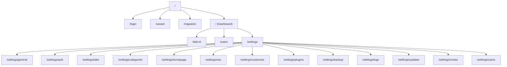
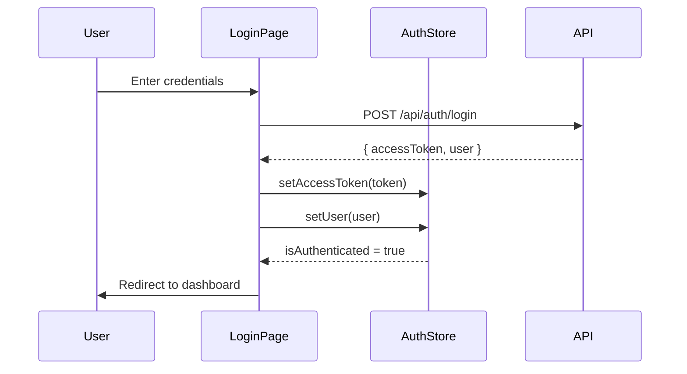

# Frontend

The OrganizrX frontend is a React 18 Single Page Application built with Vite, styled with Tailwind CSS v4, and managed with Zustand for state. This page covers routing, state management, authentication flow, API integration, and styling.

## Tech Stack

| Technology      | Purpose                           |
| --------------- | --------------------------------- |
| React 18        | UI rendering                      |
| Vite            | Build tool and dev server (:5173) |
| TanStack Router | File-based routing                |
| Zustand         | Lightweight state management      |
| Tailwind CSS v4 | Utility-first styling             |
| Axios           | HTTP client with interceptors     |

## Project Structure

```text
apps/web/src/
├── router.tsx          # Route definitions
├── api/
│   └── client.ts       # Axios instance with auth interceptors
├── store/
│   └── index.ts        # Zustand stores (auth, theme, lockscreen, UI)
├── hooks/
│   └── useAuth.ts      # Session init, auto-refresh, auth guard
├── pages/              # Page-level components
│   ├── login.tsx
│   ├── wizard.tsx
│   ├── migration.tsx
│   ├── dashboard.tsx
│   ├── tab-view.tsx
│   ├── users.tsx
│   └── settings/       # Settings sub-pages
│       ├── general.tsx
│       ├── auth.tsx
│       ├── tabs.tsx
│       └── ...
└── components/         # Shared UI components
```

## Routing

Routes are defined in `apps/web/src/router.tsx` using TanStack Router:



### Route Protection

- **Public routes**: `/login`, `/wizard` -- accessible without authentication.
- **Protected routes**: Everything else -- requires a valid access token. The `useAuthGuard` hook redirects unauthenticated users to `/login`.
- **Admin routes**: `/settings/*`, `/users` -- require Admin group (groupId 0) or equivalent.

## State Management

OrganizrX uses four independent Zustand stores defined in `apps/web/src/store/index.ts`:

### AuthState

Manages authentication tokens and user identity:

```typescript
interface AuthState {
  accessToken: string | null
  user: {
    id: number
    username: string
    email: string
    groupId: number
  } | null
  isAuthenticated: boolean

  setAccessToken: (token: string) => void
  setUser: (user: AuthState['user']) => void
  logout: () => void
}
```

### ThemeState

Controls the visual theme:

```typescript
interface ThemeState {
  theme: 'dark' | 'light'
  accentColor: string

  setTheme: (theme: 'dark' | 'light') => void
  setAccentColor: (color: string) => void
  toggleTheme: () => void
}
```

### LockscreenState

Manages the optional lockscreen feature:

```typescript
interface LockscreenState {
  isLocked: boolean
  lockTimeout: number // minutes

  lock: () => void
  unlock: () => void
  setLockTimeout: (minutes: number) => void
}
```

### UIState

General UI state for sidebar, modals, and notifications:

```typescript
interface UIState {
  sidebarCollapsed: boolean
  activeModal: string | null
  notifications: Notification[]

  toggleSidebar: () => void
  openModal: (id: string) => void
  closeModal: () => void
  addNotification: (notification: Notification) => void
  removeNotification: (id: string) => void
}
```

### Store Usage

```typescript
import { useAuthStore, useThemeStore } from '../store'

function Header() {
  const user = useAuthStore((s) => s.user)
  const theme = useThemeStore((s) => s.theme)
  const toggleTheme = useThemeStore((s) => s.toggleTheme)

  return (
    <header>
      <span>{user?.username}</span>
      <button onClick={toggleTheme}>{theme}</button>
    </header>
  )
}
```

## API Client

The Axios client in `apps/web/src/api/client.ts` handles all HTTP communication with the backend.

### Configuration

```typescript
const client = axios.create({
  baseURL: '/api',
  withCredentials: true, // Send httpOnly cookies
})
```

### Request Interceptor

Automatically attaches the access token from the auth store:

```typescript
client.interceptors.request.use((config) => {
  const token = useAuthStore.getState().accessToken
  if (token) {
    config.headers.Authorization = `Bearer ${token}`
  }
  return config
})
```

### Response Interceptor (Token Refresh)

When a request returns 401, the interceptor queues it and attempts a token refresh:

```typescript
client.interceptors.response.use(
  (response) => response,
  async (error) => {
    if (error.response?.status === 401 && !error.config._retry) {
      error.config._retry = true

      // Queue concurrent requests while refreshing
      if (!isRefreshing) {
        isRefreshing = true
        const { data } = await client.post('/auth/refresh')
        useAuthStore.getState().setAccessToken(data.data.accessToken)
        isRefreshing = false

        // Retry queued requests
        processQueue(data.data.accessToken)
      }

      return new Promise((resolve) => {
        queue.push((token: string) => {
          error.config.headers.Authorization = `Bearer ${token}`
          resolve(client(error.config))
        })
      })
    }
    return Promise.reject(error)
  }
)
```

### Typed API Namespace

The client exports a typed `api` namespace for organized endpoint access:

```typescript
export const api = {
  auth: {
    login: (data: LoginRequest) => client.post('/auth/login', data),
    refresh: () => client.post('/auth/refresh'),
    logout: () => client.post('/auth/logout'),
    me: () => client.get('/auth/me'),
  },
  users: {
    list: () => client.get('/users'),
    get: (id: number) => client.get(`/users/${id}`),
    create: (data: CreateUserRequest) => client.post('/users', data),
    update: (id: number, data: UpdateUserRequest) => client.put(`/users/${id}`, data),
    delete: (id: number) => client.delete(`/users/${id}`),
  },
  tabs: {
    list: () => client.get('/tabs'),
    sidebar: () => client.get('/tabs/sidebar'),
    get: (id: number) => client.get(`/tabs/${id}`),
    // ...
  },
  // Additional namespaces for categories, settings, bookmarks, etc.
}
```

## Authentication Flow

The frontend authentication lifecycle is managed by three hooks in `apps/web/src/hooks/useAuth.ts`:

### useSessionInit

Called once at app startup. Attempts to restore a session by calling the refresh endpoint (the httpOnly cookie is sent automatically):

```typescript
function useSessionInit() {
  useEffect(() => {
    const init = async () => {
      try {
        const { data } = await api.auth.refresh()
        useAuthStore.getState().setAccessToken(data.data.accessToken)

        const { data: me } = await api.auth.me()
        useAuthStore.getState().setUser(me.data)
      } catch {
        // No valid session, user needs to log in
      }
    }
    init()
  }, [])
}
```

### useAutoRefresh

Sets up a timer to refresh the access token before it expires (every 14 minutes for a 15-minute token):

```typescript
function useAutoRefresh() {
  useEffect(() => {
    const interval = setInterval(
      async () => {
        try {
          const { data } = await api.auth.refresh()
          useAuthStore.getState().setAccessToken(data.data.accessToken)
        } catch {
          useAuthStore.getState().logout()
        }
      },
      14 * 60 * 1000
    )

    return () => clearInterval(interval)
  }, [])
}
```

### useAuthGuard

Redirects unauthenticated users to the login page:

```typescript
function useAuthGuard() {
  const isAuthenticated = useAuthStore((s) => s.isAuthenticated)
  const navigate = useNavigate()

  useEffect(() => {
    if (!isAuthenticated) {
      navigate('/login')
    }
  }, [isAuthenticated])
}
```

### Login Flow Sequence



## Styling

### Tailwind CSS v4

OrganizrX uses Tailwind CSS v4, which provides:

- CSS-first configuration (no `tailwind.config.js`)
- Native cascade layers
- Lightning CSS for fast compilation

### Theme Support

The theme system uses CSS custom properties toggled by the `ThemeState` store:

```css
/* Dark theme (default) */
:root {
  --color-bg-primary: #0f0f0f;
  --color-bg-secondary: #1a1a1a;
  --color-text-primary: #ffffff;
  --color-accent: var(--accent-color, #3b82f6);
}

/* Light theme */
[data-theme='light'] {
  --color-bg-primary: #ffffff;
  --color-bg-secondary: #f5f5f5;
  --color-text-primary: #0f0f0f;
}
```

Components use these variables via Tailwind utility classes, ensuring consistent theming across the application.

### Component Patterns

OrganizrX follows these patterns for components:

- **PascalCase** for component names and filenames
- **Co-located styles** via Tailwind utility classes (no separate CSS files)
- **Props interfaces** defined inline or co-located

```typescript
interface ButtonProps {
  variant: 'primary' | 'secondary' | 'danger'
  size?: 'sm' | 'md' | 'lg'
  children: React.ReactNode
  onClick?: () => void
}

function Button({ variant, size = 'md', children, onClick }: ButtonProps) {
  return (
    <button
      className={cn(
        'rounded font-medium transition-colors',
        variants[variant],
        sizes[size]
      )}
      onClick={onClick}
    >
      {children}
    </button>
  )
}
```

## Plugin Widgets on the Frontend

Plugin widgets are rendered on the homepage dashboard. Each widget:

1. Fetches data from the plugin's API endpoint (e.g., `GET /api/plugins/plex/status`)
2. Renders in a card with the widget's `name` as the title
3. Auto-refreshes based on the `refreshInterval` defined in the `WidgetDefinition`
4. Respects the `defaultSize` for grid layout placement

The dashboard queries the list of active plugins and their widget definitions, then renders each widget in a responsive grid layout.
